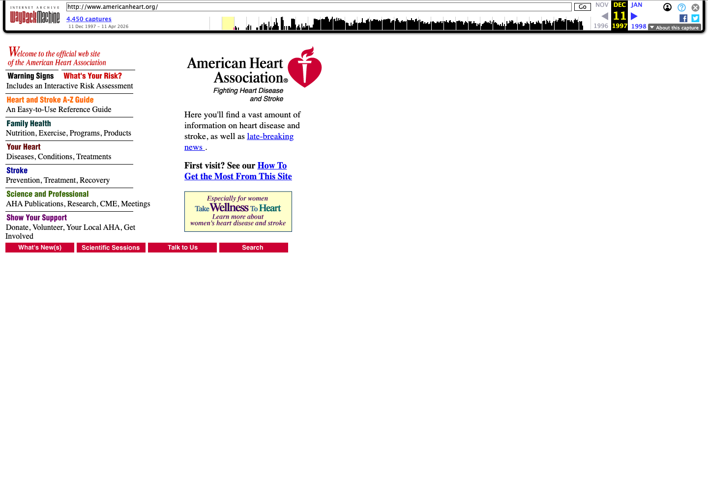
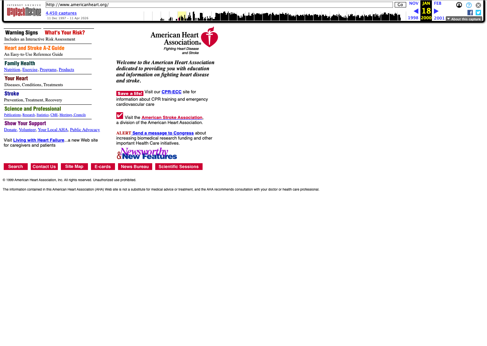
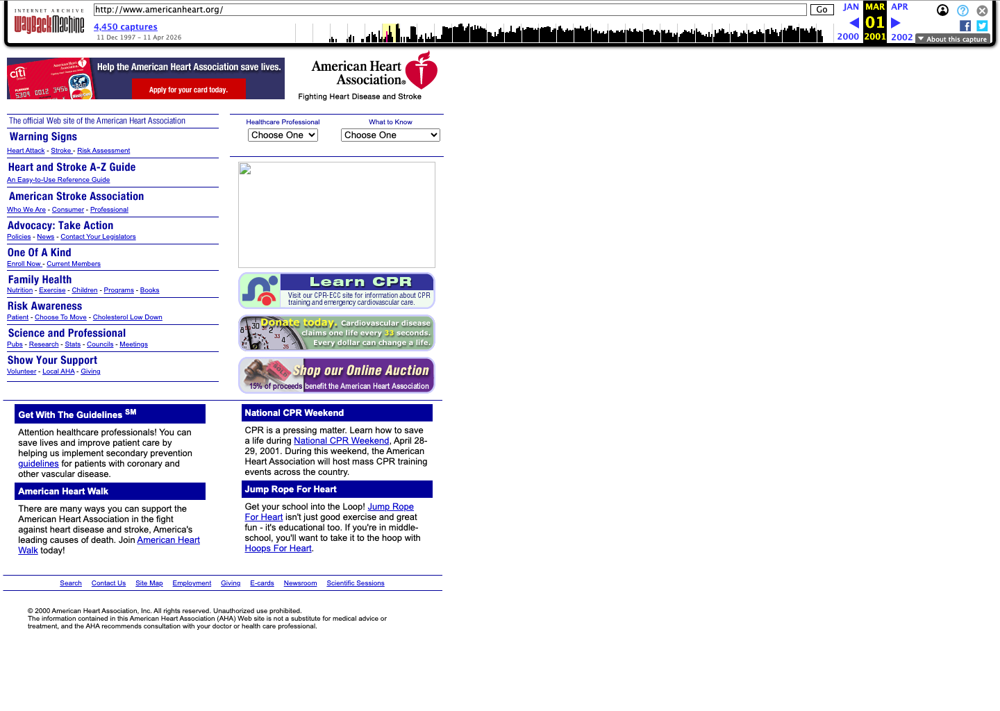
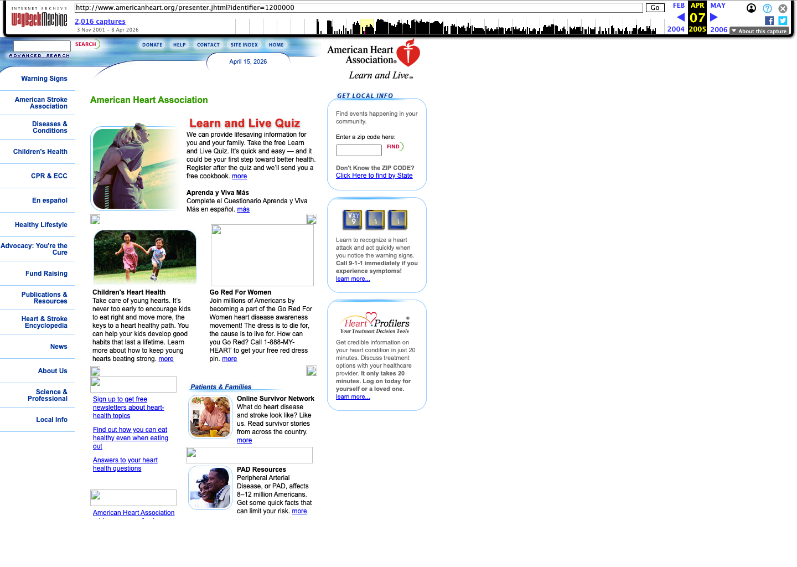
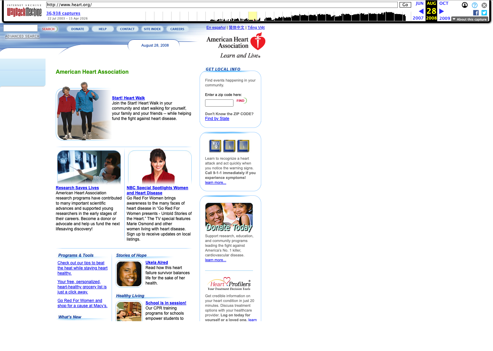
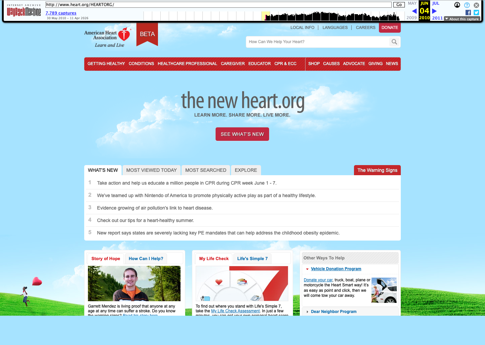
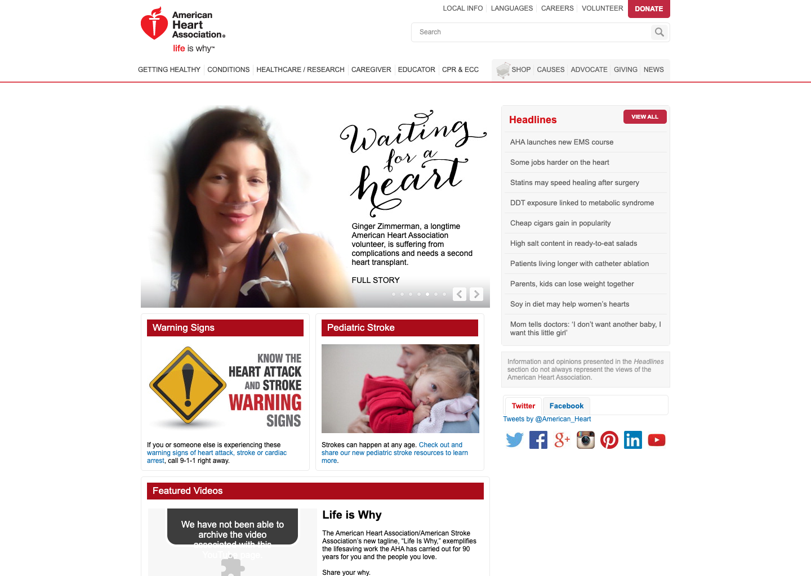
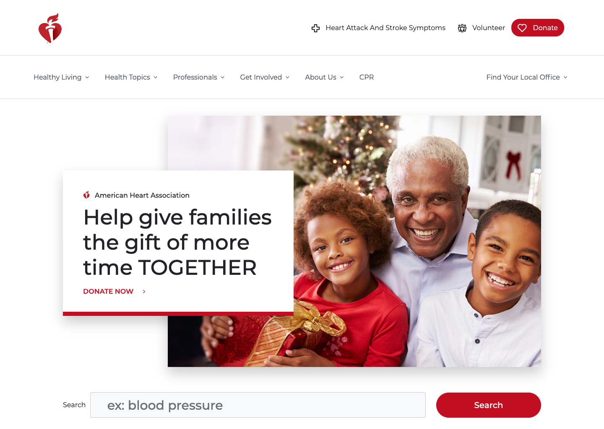
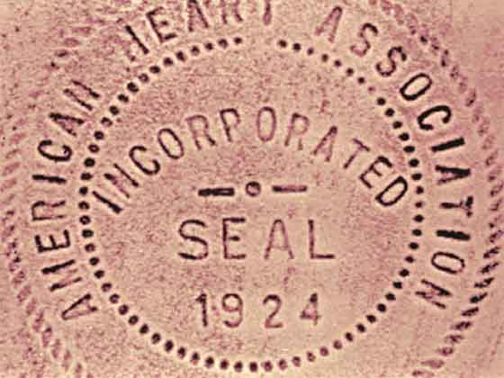
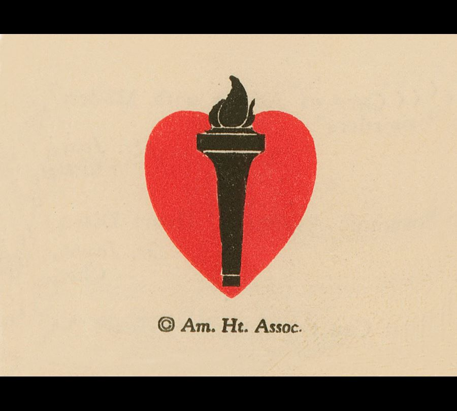

# AHA Visual Timeline

This is the image-led companion to the brand-history report. It is meant to make the shifts visible fast.

## Website through the years

### 1997: first recorded AHA website homepage found so far

This is the earliest viable AHA homepage capture I found in Wayback. It is small, direct and almost entirely link-led. The site behaves more like a structured information index than a branded experience.

Source:
- Wayback snapshot: `https://web.archive.org/web/19971211070220/http://www.americanheart.org/`

### 2000: still compact, still utility-first

By `2000`, the site is still dominated by left-rail navigation, dense link lists and practical subject access. The visual system is only doing a modest amount of emotional work.

Source:
- Wayback snapshot: `https://web.archive.org/web/20000118235706/http://www.americanheart.org/`

### 2001: same skeleton, slightly clearer hierarchy

The `2001` homepage is still overwhelmingly utility-led, but it starts to show a slightly more managed hierarchy. It feels less like a raw directory and more like an early portal homepage.

Source:
- Wayback snapshot: `https://web.archive.org/web/20010301172542/http://www.americanheart.org/`

### 2005: a denser promotional homepage appears

By `2005`, the homepage is carrying much more campaign and content promotion. This is still not a modern brand experience, but it is clearly moving away from pure index behavior.

Source:
- Wayback snapshot: `https://web.archive.org/web/20050407153902/http://www.americanheart.org/presenter.jhtml?identifier=1200000`

### 2008: the first strong consumer-homepage shift

The `2008` snapshot is one of the clearest visual turning points. The page opens into a large sky-blue hero, stronger promotion blocks and a broader public-facing homepage rhythm.

Source:
- Wayback snapshot: `https://web.archive.org/web/20080828185308/http://www.heart.org/`

### 2010: the new heart.org transition

By `2010`, that shift is explicit. The page literally announces `the new heart.org`, which makes this a useful bridge between the older directory-style AHA site and the cleaner, more editorial platform that follows.

Source:
- Wayback snapshot: `https://web.archive.org/web/20100604193513/http://www.heart.org/HEARTORG/`

### 2014: utility plus motive language

The `2014` homepage is crowded compared with the modern site, but it already shows the `life is why` language. This is a useful snapshot of AHA in transition: still utility-heavy, but trying to motivate as much as instruct.

Source:
- Wayback snapshot: `https://web.archive.org/web/20140802030704/http://www.heart.org/HEARTORG/`

### 2018: a cleaner, white-led system

By late `2018`, the site shell is noticeably calmer. More white space. Cleaner navigation. Bigger human imagery. Red is still powerful, but it works more as a precise signal than as a blanket treatment.

Source:
- Wayback snapshot: `https://web.archive.org/web/20181220023507/https://www.heart.org/`

## 1924: institutional authority before public brand

The seal feels legal, formal and civic. The AHA is still establishing itself as an institution, not yet behaving like a mass public campaign brand.

Source:
- Official history page: `https://www.heart.org/en/about-us/history-of-the-american-heart-association`

## Early mark: the organization as association first

The older official logo feels more emblematic and conventional than the current heart-and-torch mark. It carries seriousness, but less of the clean digital shorthand the current brand depends on.

Source:
- Official history page: `https://www.heart.org/en/about-us/history-of-the-american-heart-association`

## Current AHA mark: the heart and torch distilled

The current masterbrand mark is stronger in digital contexts because it is simpler, more scalable and more icon-friendly. The symbol now does a lot of work quickly.

Source:
- Repo asset copied from `reference/assets/aha-logo-red.png`

## Go Red for Women: red becomes a social signal

This is where AHA red becomes participatory. The system is no longer only about recognition. It becomes a rallying device.

Source:
- `https://www.goredforwomen.org/en/about-go-red-for-women`

## Life Is Why: motive language enters the system

`Life Is Why` is important because it reframes the brand from instruction to motive. It asks people to connect heart health to the people and moments they want to stay alive for.

Source:
- `https://www.heart.org/en/get-involved/ways-to-give/life-is-why`

## Centennial framing: heritage used as momentum, not nostalgia

The centennial materials are useful because they show how the modern AHA tells its own history: proud, human and forward-moving, not trapped in institutional nostalgia.

Source:
- `https://www.heart.org/en/around-the-aha/a-century-of-heart`
