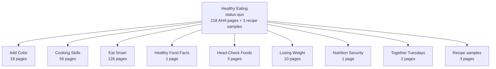

# Healthy Eating Topic Network 2026-04-29

## Scope
- Start page: `https://www.heart.org/en/healthy-living/healthy-eating`
- Method: recursive in-branch capture from the live Healthy Eating area
- Include: current `www.heart.org/en/healthy-living/healthy-eating` HTML pages and a small sample of recipe pages
- Recipe rule: capture `3` recipe pages only, not the full recipes library
- Exclude: global navigation, footer links, social links, PDFs, media files, non-HTML assets, and pages outside the Healthy Eating branch

## Evidence
- screenshots: `reference/evidence/screenshots/aha-healthy-eating-topic-network-2026-04-29/`
- manifest: `reference/evidence/screenshots/aha-healthy-eating-topic-network-2026-04-29/manifest.csv`
- manifest JSON: `reference/evidence/screenshots/aha-healthy-eating-topic-network-2026-04-29/manifest.json`
- link inventory: `reference/evidence/screenshots/aha-healthy-eating-topic-network-2026-04-29/link_inventory.csv`
- sitemap image: `reference/evidence/mockups/aha-healthy-eating-topic-network-2026-04-29/healthy-eating-current-sitemap.png`
- sitemap SVG: `reference/evidence/mockups/aha-healthy-eating-topic-network-2026-04-29/healthy-eating-current-sitemap.svg`
- sitemap HTML: `reference/evidence/mockups/aha-healthy-eating-topic-network-2026-04-29/healthy-eating-current-sitemap.html`
- capture script: `reference/evidence/mockups/aha-healthy-eating-topic-network-2026-04-29/capture-healthy-eating.mjs`
- network summary: `reference/evidence/mockups/aha-healthy-eating-topic-network-2026-04-29/healthy-eating-current-network-summary.json`

## Capture summary
- `221` HTML pages captured at `1280px` width
- `218` pages are in the AHA Healthy Eating branch
- `3` recipe pages were captured as representative samples
- `0` page-capture errors
- `344` in-scope link targets logged
- `806` out-of-scope, non-page, or non-HTML links logged

## Visit math
- To review the current Healthy Eating branch at captured depth, a user or auditor would need to inspect `218` AHA pages plus the recipes entry points.
- The count does not include the full recipes library. The recipe area is intentionally sampled because it is its own large content system.
- The capture confirms that Healthy Eating is already a large content network, not a simple hub with a few leaves.

## Route map

## Branch detail
- `Healthy Eating` root: `1` page
- `Add Color`: `18` pages
- `Cooking Skills`: `56` pages
- `Eat Smart`: `126` pages
- `Healthy Food Facts`: `1` page
- `Heart-Check Foods`: `3` pages
- `Losing Weight`: `10` pages
- `Nutrition Security`: `1` page
- `Together Tuesdays`: `2` pages
- `Recipe samples`: `3` pages

## Working observations
- The current area is heavily weighted toward `Eat Smart`, which holds `126` captured pages.
- `Cooking Skills` is also substantial at `56` pages and behaves like a practical learning branch rather than a small support category.
- `Add Color`, `Losing Weight`, and `Heart-Check Foods` are smaller but still mix evergreen advice, infographics, article-style content, and practical support.
- The root Healthy Eating page links into recipes, article collections, programs, shopping and cooking advice, nutrition basics, Spanish infographics, cookbooks, and food-certification content.
- The current system does not clearly separate evergreen guide material from editorial or resource material. Both are presented as peer navigation items.
- The recipe system is large enough that it should probably be treated as a linked tool/library, not as a normal child page sequence inside Healthy Eating.
- The status quo supports the earlier guide-system direction: the future IA needs one durable Healthy Eating guide structure with supporting articles, recipes, infographics, and tools linked from the relevant chapters.

## Retrieval note
- Use this capture when discussing current Healthy Eating page volume, current Healthy Living simplification, evergreen guide structure, recipe treatment, and article/resource consolidation.
- Do not use the `221` count as a full recipes-library count. It is the Healthy Eating branch plus `3` recipe samples.
