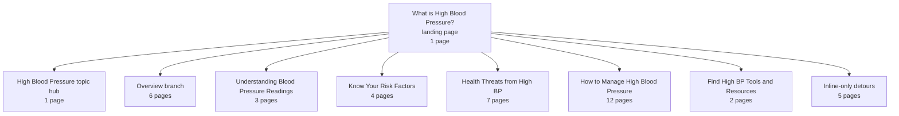

# High Blood Pressure Topic Network 2026-04-20

## Scope
- Start page: `https://www.heart.org/en/health-topics/high-blood-pressure/the-facts-about-high-blood-pressure`
- Method: one-hop capture from the live page only
- Include: topic-relevant HTML pages linked from the right-rail section nav and inline article body
- Exclude: global nav, footer links, share links, PDFs, YouTube, and WatchLearnLive player URLs

## Evidence
- screenshots: `reference/evidence/screenshots/aha-high-blood-pressure-topic-network-2026-04-20/`
- manifest: `reference/evidence/screenshots/aha-high-blood-pressure-topic-network-2026-04-20/manifest.csv`
- inventory: `reference/evidence/screenshots/aha-high-blood-pressure-topic-network-2026-04-20/link_inventory.csv`
- second-hop diagram files: `reference/evidence/mockups/aha-high-blood-pressure-topic-network-2026-04-20/`
- second-hop mermaid source: `reference/evidence/mockups/aha-high-blood-pressure-topic-network-2026-04-20/second-hop-network-figjam.mmd`
- second-hop svg: `reference/evidence/mockups/aha-high-blood-pressure-topic-network-2026-04-20/second-hop-network-figjam.svg`
- second-hop png: `reference/evidence/mockups/aha-high-blood-pressure-topic-network-2026-04-20/second-hop-network-figjam.png`
- second-hop summary: `reference/evidence/mockups/aha-high-blood-pressure-topic-network-2026-04-20/second-hop-network-summary.json`
- second-hop new-node inventory: `reference/evidence/mockups/aha-high-blood-pressure-topic-network-2026-04-20/second-hop-new-nodes.csv`

## Capture summary
- 52 unique candidate links after dedupe
- 41 HTML pages captured at `1280px` width
- 25 pages came from the sidebar only
- 11 pages appeared in both the sidebar and inline body
- 5 pages came from inline links only
- 11 links were excluded as non-page or non-HTML resources

## Visit math
- To exhaust the one-hop HTML page network from this landing page, a user would need to visit `41` pages total.
- That count includes the current landing page and the parent `High Blood Pressure` topic page.
- In practical terms: a user who starts on `What is High Blood Pressure?` still has `40` more HTML pages they could visit from this one page's immediate route-outs.

## Route map

## Branch detail
- `High Blood Pressure` topic hub: `1` page
- `What is High Blood Pressure?` branch pages: `6`
- `Understanding Blood Pressure Readings` branch pages: `3`
- `Know Your Risk Factors` branch pages: `4`
- `Health Threats from High BP` branch pages: `7`
- `How to Manage High Blood Pressure` branch pages: `12`
- `Find High BP Tools and Resources` branch pages: `2`
- Inline-only detours outside the main branch: `5`

## Working observations
- The current page already behaves like a partial hub. It mixes overview content, embedded utilities, consequence explanations, and route-outs to deeper leaves.
- The sidebar holds the main blood-pressure information tree, while the inline links open adjacent alleys into consequences and behavior support.
- The inline-only pages are still relevant to the topic, but they sit outside the main high-blood-pressure branch. In this pass those were:
  - `atherosclerosis`
  - `heart attack`
  - `Getting Active`
  - `Eat Smart`
  - `Types of Stroke and Treatment`
- The biggest branch is `How to Manage High Blood Pressure` with `12` pages, which is a strong signal that the current system spreads behavior-change guidance across too many leaves for a topic this central.
- The combined set suggests the real user journey is not one branch. It is a blend of:
  - fundamentals
  - readings and urgency
  - risk factors
  - downstream health threats
  - lifestyle and medication management
  - adjacent condition education
  - tools and lesson content

## Retrieval note
- Use this capture set when mapping a single-page authority model, sticky in-page navigation, or consolidation candidates for the high-blood-pressure topic cluster.
- If the work needs deeper leaf coverage, run a second-pass crawl from the most important child pages instead of assuming this one-hop set is exhaustive.

## Two-hop expansion
- A second-pass crawl from the first-hop set found `155` additional HTML pages.
- That brings the reachable topic network from this landing page to `196` unique HTML pages within two hops.
- The second-hop crawl confirms that the current information scent does not just deepen the blood-pressure branch. It quickly opens into neighboring education systems for:
  - fitness
  - healthy eating
  - heart attack
  - stroke
  - cholesterol
  - heart failure
  - sleep and related-risk content
- The most repeated destination in the second-hop crawl is `High Blood Pressure Health Lesson`, which appeared as a linked destination `35` times.

## Two-hop concentration points
- Biggest destination family: `fitness` with `45` pages
- Next largest: `heart attack` with `40` pages
- Then: `cholesterol` with `22` pages
- Then: `stroke` with `21` pages
- Then: `healthy eating` with `15` pages
- Smaller but still relevant spillovers include:
  - `heart failure`
  - `sleep apnea and heart disease / stroke`
  - `high blood pressure and women`
  - `kidney disease and diabetes`
  - `professional guideline and nephrology pages`

## Two-hop read
- The current landing page is not just a high-blood-pressure explainer. It is an entry point into a much larger cardiovascular learning maze.
- A user trying to fully understand the topic from this one start page can easily slide from blood-pressure basics into adjacent condition education and general lifestyle education without a strong sense of where the core topic boundary ends.
- That is a strong argument for a more authoritative single-page model with:
  - a durable sticky chapter nav
  - more content held on the main page before users need to jump out
  - clearer separation between core topic chapters and related-condition detours
  - explicit “go deeper” branch-outs once the core blood-pressure guidance has already been covered
